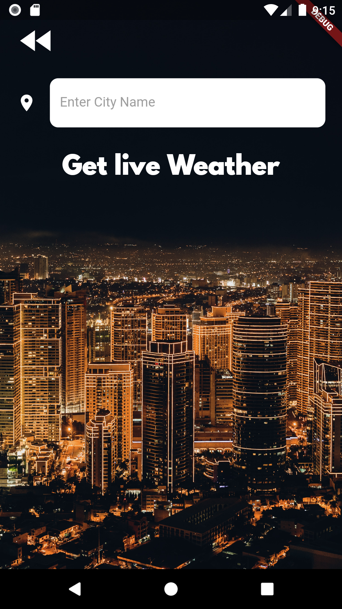
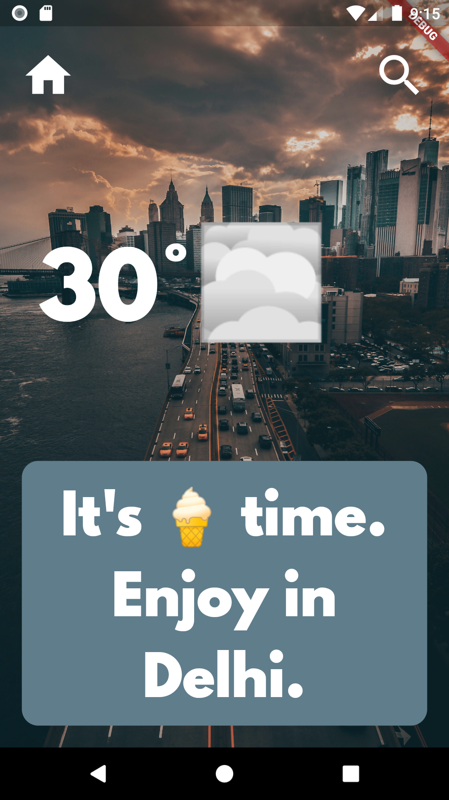
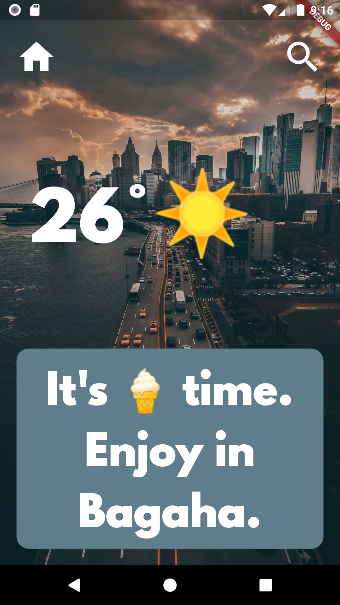

# WeatherZone

A Flutter project to find out the live weather data in the current location of the device as well as the weather for any city which we want.

~This project includes Geolocator package to get live location data for both iOS and Android.

# Weather Api: https://home.openweathermap.org/api_keys

# framework
~ Flutter framework

<!-- # Snapshots

 -->
## Screenshots

  | Home Page                                                    | Search Page                                                 | Search Result                                                 |
| -------------------------------------------------------------- | ----------------------------------------------------------------------- | -------------------------------------------------------------------- |
|  |  |  |

https://user-images.githubusercontent.com/43759182/114301636-5f2d7380-9ae3-11eb-9cf5-4abafda808cd.mp4

