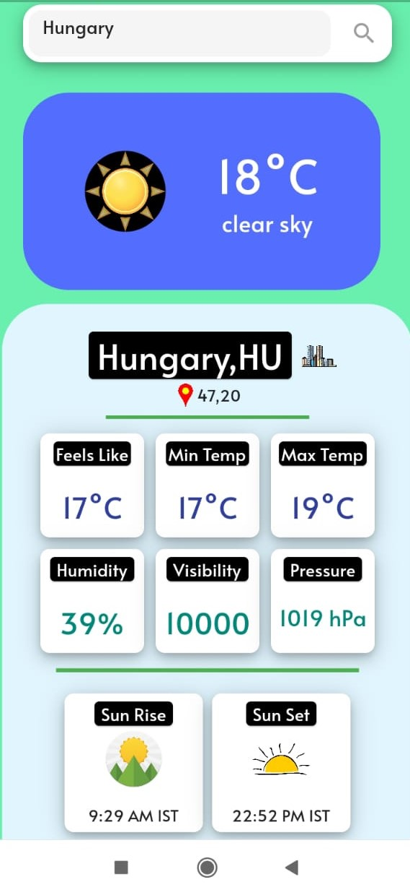
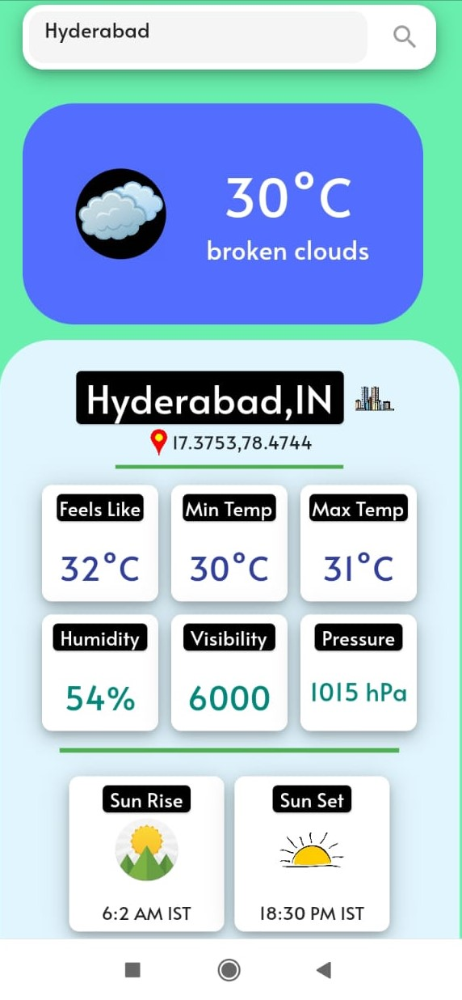
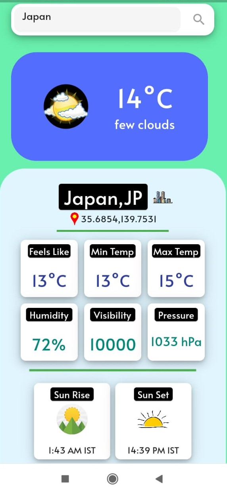
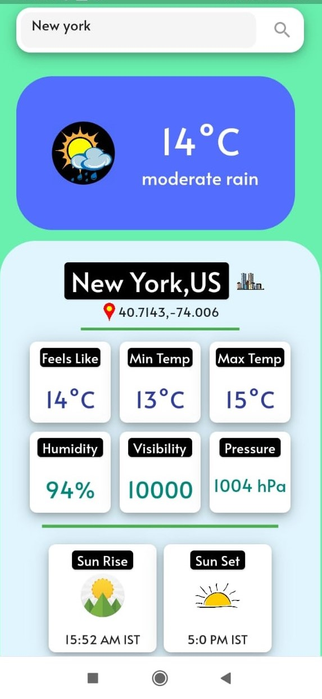

# WeatherZone

A Flutter project to find out the live weather data in the current location of the device as well as the weather for any city which we want.
The detailed report of a place includes :
a) Current Temperature
b) Maximum and Minimum Temperature
c) Air pressure
d) Humidity
e) Visibility
f) Sun Rise and Sun Set

~This project includes Geolocator package to get live location data for both iOS and Android.

## Weather Api: https://home.openweathermap.org/api_keys

# framework
~ Flutter framework

<!-- # Snapshots

 -->

## Video Preview

## Screenshots

  | Home Page                                                    | Search Result                                                 | Search Result                                                 | Search Result                                                 |
| -------------------------------------------------------------- | ----------------------------------------------------------------------- | -------------------------------------------------------------------- | ---------------------------------------------------------------------|
|  |  |  |  |

